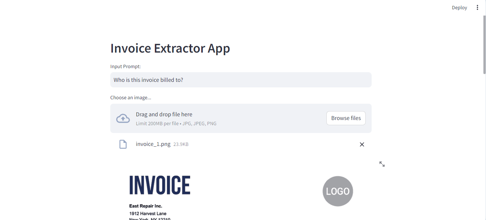
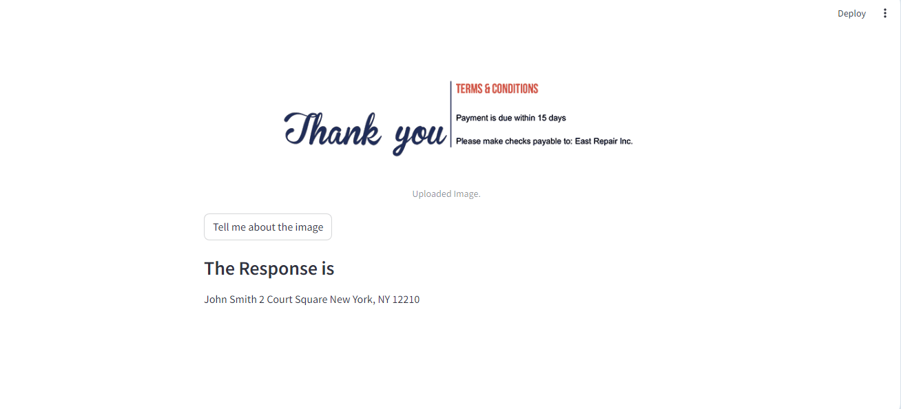
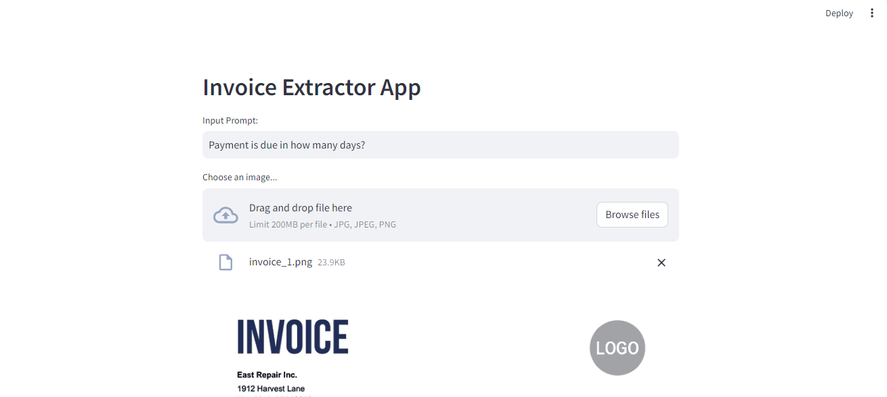
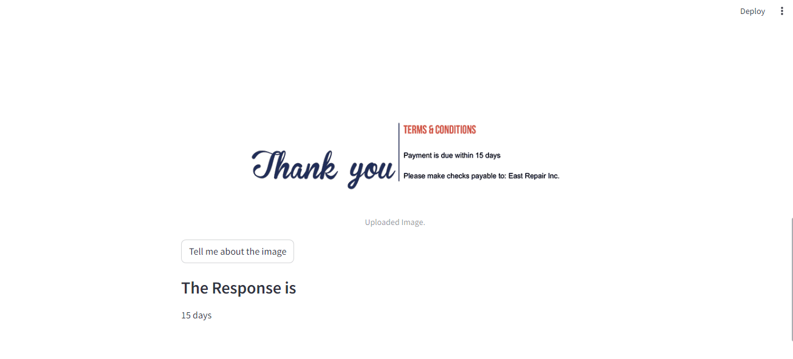

# Invoice Extractor LLM  
Invoice extractor webapp that uses Google's open-source Large Image Model gemini pro (vision LLM).  
When a user uploads any invoice, it extracts the information from that invoice.  The user asks any question as a prompt and the app answers. 

## Working  
The working of this streamlit webapp is shown in the Screen shots below:  

### Case 1:  

1. The user uploads the invoice:  

    
    
2. As shown in the above screen capture, the user asked who is this invoice billed to?  

3. When the prompt is passed, the system replies:  
   
    

As shown in the screen capture above, the app generates the name and address of the person whom this invoice is billed to.  

### Case 2:  

1. The user asks, "Payment is due in how many days?"  

    

2. The system replies with the number of days.  

